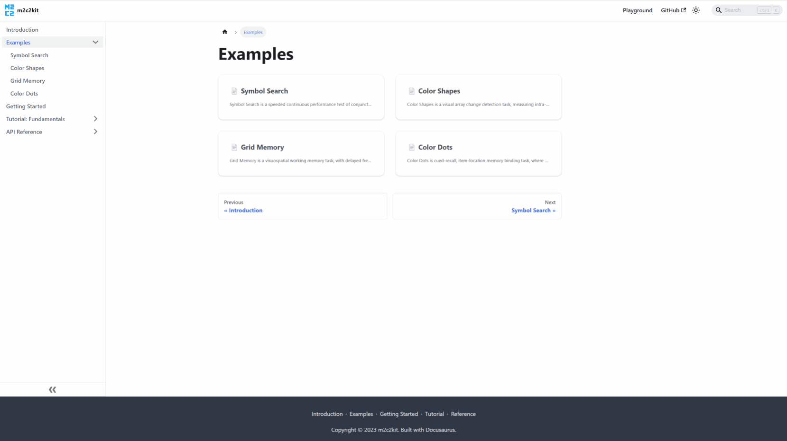

<div align="center">

<h1>m2c2kit</h1>

_a library for cross-platform cognitive assessments_

[](https://www.typescriptlang.org)
[](https://opensource.org/licenses/MIT)
[](https://GitHub.com/m2c2-project/m2c2kit/stargazers/)
[](https://GitHub.com/m2c2-project/m2c2kit/watchers/)

</div>

m2c2kit is a library for creating cross-platform cognitive assessments. It is produced by the Ambulatory Methods for Measuring Cognitive Change research project (Award #U2CAG060408), sponsored by the National Institute on Aging.

Features:

- **Mobile first**. Optimized for touch and mobile devices while also usable on desktops.
- **Portable**. Use on browsers, compile within native apps using webviews, or embed in products like RedCap or Qualtrics. A shared assessment codebase reduces development time and promotes experiment standardization across devices and services.
- **Rapid iteration**. Quickly develop and test new assessments with the JavaScript-based library and deploy them in studies.

m2c2kit is written in Typescript and leverages Google's [canvaskit-wasm](https://www.npmjs.com/package/canvaskit-wasm) Skia-based graphics engine to present cognitive assessments using HTML5 and JavaScript.

<div align="center">

[Examples](#examples) •
[Documentation](#documentation) •
[Installation](#installation) •
[Building](#building) •
[Packages](#packages) •
[Testing](#testing) •
[Integrations](#integrations) •
[Contributing](#contributing) •
[License](#license)

</div>

## Examples

---

See m2c2kit assessments in your browser at https://m2c2-project.github.io/m2c2kit/docs/category/examples



## Documentation

---

Documentation, including live tutorials, is available at https://m2c2-project.github.io/m2c2kit. The repository [change log](CHANGELOG.md) documents notable changes.

## Installation

---

### No-install quickstart

Go to the m2c2kit [playground](https://m2c2-project.github.io/m2c2kit/playground/) to modify assessments (or create new ones) in your browser.


### Local install

Make sure you have installed [Node.js](https://nodejs.org) (version >=18). The CLI can quickly scaffold a demo app and serve it on your local machine:

```
npm install -g @m2c2kit/cli
m2 new myapp
cd myapp
npm run serve
```

You can now go to http://localhost:3000 to view the demo app.

See the [`@m2c2kit/cli`](packages/cli) package for more information on using the CLI.

## Building

---

The installation steps above are all you need to start using m2c2kit and creating assessments.

To explore m2c2kit in depth, build the library from source. m2c2kit is a mono repository. Assuming you have installed [Node.js](https://nodejs.org), execute the following from the respository root:

```
npm install
npm run build
```

This will build all packages. Optional: see [`BUILDNOTES.md`](BUILDNOTES.md) for a custom build of `canvaskit-wasm` to increase compatibility with older devices

## Packages

---

- [`@m2c2kit/core`](packages/core) - The m2c2kit core functionality.
- [`@m2c2kit/addons`](packages/addons) - Convenience elements, such as buttons, grids, dialog boxes, a virtual keyboard, and instructions, constructed out of the core primitives.
- [`@m2c2kit/survey`](packages/survey) - Survey functionality that can be added to m2c2kit apps, using the MIT-licensed [survey-js](https://www.npmjs.com/package/surveyjs) library.
- [`@m2c2kit/cli`](packages/cli) - Command line interface for scaffolding new m2c2kit apps.
- [`@m2c2kit/assessments-demo`](packages/assessments-demo) - Demonstration app that shows the assessments created by the m2c2kit team.
- [`@m2c2kit/assessment-color-dots`](packages/assessment-color-dots) - Color Dots is cued-recall, item-location memory binding task, where after viewing 3 dots for a brief period of time, participants report: (1) the color at a cued location; (2) the location of a cued color.
- [`@m2c2kit/assessment-grid-memory`](packages/assessment-grid-memory) - Grid Memory is a visuospatial working memory task, with delayed free recall. After a brief exposure, and a short distraction phase, participants report the location of dots on a grid.
- [`@m2c2kit/assessment-symbol-search`](packages/assessment-symbol-search) - Symbol Search is a speeded continuous performance test of conjunctive feature search in which respondents identify matching symbol pairs as quickly and as accurately as they can.
- [`@m2c2kit/assessment-color-shapes`](packages/assessment-color-shapes) - Color Shapes is a visual array change detection task, measuring intra-item feature binding, where participants determine if shapes change color across two sequential presentations of shape stimuli.
- [`@m2c2kit/assessment-cli-starter`](packages/assessment-cli-starter) - The assessment that is created when the CLI scaffolds a new app. It is a simple implementation of a [Stroop](https://en.wikipedia.org/wiki/Stroop_effect) assessment.
- [`@m2c2kit/sage-research`](packages/sage-research) - Utility functions for embedding m2c2kit assessments in iOS and Android apps developed by [Sage Bionetworks](https://sagebionetworks.org/). End users will not need to install this.
- [`@m2c2kit/build-helpers`](packages/build-helpers) - Utility functions for building m2c2kit apps. End users will not need to install this explicitly. It is automatically installed by the CLI as a dependency.

## Testing

---

Using [Jest](https://jestjs.io/), some unit tests have been written to provide initial test coverage of the [`@m2c2kit/core`](packages/core) and [`@m2c2kit/survey`](packages/survey) libraries. The [canvaskit-wasm](https://www.npmjs.com/package/canvaskit-wasm) dependency is mocked (with a combination of stubs, [node-canvas](https://www.npmjs.com/package/canvas), and [jsdom](https://www.npmjs.com/package/jsdom)) so tests can run without invoking this dependency.

## Integrations

---

m2c2kit is flexible and can be integrated into many use cases:

- [`no-js-bundler-development`](examples/no-js-bundler-development/) - How to use m2c2kit in simple JavaScript without bundlers or TypeScript transplilation.

- [`android-simple-webview`](examples/android-simple-webview/) - Android Studio project showing m2c2kit assessments integrated into a native Android app. Assessments are bundled into the app and do not require an internet connection.

- [`ios-simple-webview`](examples/ios-simple-webview/) - Xcode project showing m2c2kit assessments integrated into a native iOS app. Assessments are bundled into the app and do not require an internet connection.

## Contributing

---

[Prettier](https://prettier.io/) has been configured to automatically run on each commit. It will format TypeScript, JavaScript, HTML, and JSON to [uniform coding styles](https://prettier.io/docs/en/why-prettier.html).

## License

---

MIT
