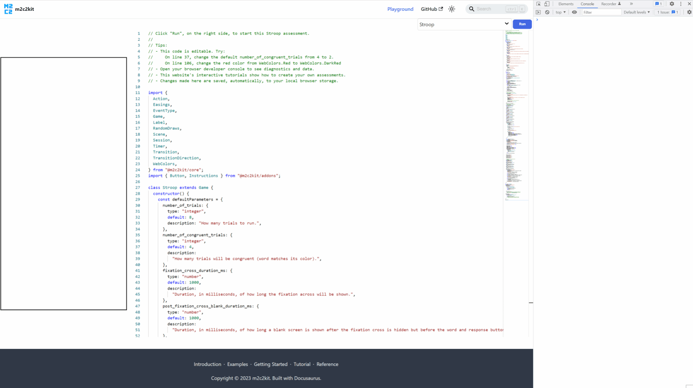

<div align="center">

<h1>m2c2kit</h1>

_a library for cross-platform cognitive assessments_

[](https://www.typescriptlang.org)
[](https://opensource.org/licenses/MIT)
[](https://GitHub.com/m2c2-project/m2c2kit/stargazers/)
[](https://GitHub.com/m2c2-project/m2c2kit/watchers/)

</div>

m2c2kit is a library for creating cross-platform cognitive assessments. It is produced by the Mobile Monitoring of Cognitive Change (M2C2) research project, sponsored by the National Institute on Aging.

m2c2kit is written in Typescript and leverages Google's [canvaskit-wasm](https://www.npmjs.com/package/canvaskit-wasm) Skia-based graphics engine to present cognitive assessments using HTML5 and JavaScript. Users can take these assessments with a desktop or mobile browser, or the assessments can be programmed into native mobile apps using a webview.

<div align="center">

[No-install quickstart](#no-install-quickstart) •
[Local install](#local-install) •
[Packages](#packages) •
[Building](#building) •
[Testing](#testing) •
[Contributing](#contributing) •
[License](#license)

</div>

## No-install quickstart

Go to the m2c2kit [playground](https://m2c2kit.z13.web.core.windows.net/) to take assessments, view assessment source code (TypeScript), and modify assessments (or create new ones) in your web browser.



## Local install

Make sure you have installed [Node.js](https://nodejs.org) (version >=16). The CLI can quickly scaffold a demo app and serve it on your local machine.

```
npm install -g @m2c2kit/cli
m2 new myapp
cd myapp
npm run serve
```

You can now go to http://localhost:3000 to view the demo app.

See the [`@m2c2kit/cli`](packages/cli) package for more information on using the CLI.

## Packages

- [`@m2c2kit/core`](packages/core) - The m2c2kit core functionality.
- [`@m2c2kit/addons`](packages/addons) - Convenience elements, such as buttons, grids, and instructions, constructed out of the core primitives.
- [`@m2c2kit/survey`](packages/survey) - Survey functionality that can be added to m2c2kit apps, using the MIT-licensed [survey-js](https://www.npmjs.com/package/surveyjs) library.

- [`@m2c2kit/cli`](packages/cli) - Command line interface for scaffolding new m2c2kit apps.
- [`@m2c2kit/assessments-demo`](packages/assessments-demo) - Demonstration app that shows the assessments created by the m2c2kit team.
- [`@m2c2kit/assessment-color-dots`](packages/assessment-color-dots) - A cued-recall, item-location memory binding task, where after viewing 3 dots for a brief period of time, participants are to report: (1) the color at a cued location; (2) the location of a cued color.
- [`@m2c2kit/assessment-grid-memory`](packages/assessment-grid-memory) - A visuospatial working memory task, with delayed free recall. After a brief exposure, and a short distraction phase, participants are asked to report the location of dots on a grid.
- [`@m2c2kit/assessment-symbol-search`](packages/assessment-symbol-search) - A speeded continuous performance test of conjunctive feature search, where participants are asked to identify matching symbol pairs.
- [`@m2c2kit/assessment-cli-starter`](packages/assessment-cli-starter) - The assessment that is created when the CLI scaffolds a new app. It is a simple implementation of a [Stroop](https://en.wikipedia.org/wiki/Stroop_effect) assessment.
- [`@m2c2kit/playground`](packages/playground) - A playground to showcase existing m2c2kit assessments and develop new ones, in the browser. The playground has a simple IDE that shows the source code of the assessment, which users can modify. It will also transpile the source code from TypeScript to JavaScript.
- [`@m2c2kit/sage-research`](packages/sage-research) - Utility functions for embedding m2c2kit assessments in iOS and Android apps developed by [Sage Bionetworks](https://sagebionetworks.org/). End users will not need to install this.
- [`@m2c2kit/build-helpers`](packages/build-helpers) - Utility functions for building m2c2kit apps. End users will not need to install this explicitly. It is automatically installed as a dependency.

## Building

m2c2kit is a mono repository. Assuming you have installed [Node.js](https://nodejs.org), execute `npm install` then `npm run build` from the repository root. This will build all packages except for the m2c2kit playground. The playground is an Angular app that must be built separately, _after_ the other m2c2kit packages have been built. To build the playground, execute `npm install` then `npm run build` from the playground root (`packages/playground`).

### Optional: custom build of `canvaskit-wasm` to increase compatibility with older devices

On some older Android devices, text drawn with `canvaskit-wasm` is sometimes distorted. The problem looks identical to the issue raised at https://github.com/flutter/flutter/issues/75327. It is related to a bug in some Adreno GPUs, because it is referenced in a fix at https://skia-review.googlesource.com/c/skia/+/571418/, which is part of `canvaskit-wasm` 0.36.1. Unfortunately, we have noticed the same bug in other older GPUs, and the fix is not applied to them. A more aggresive solution is to apply the fix to _all_ GPUs. While this reduces performance, our use case is relatively light on the GPU, and thus we make this tradeoff because we prioritize compatibility with all devices. To do this, we must modify skia's C++ code.

These steps are optional, but if you observe text distortion, you can make a custom build of `canvaskit-wasm`. The following has been verified to work in WSL-Ubuntu:

1. Clone the repository from within your home directory: `git clone https://github.com/google/skia.git`

2. Optional: To build from a specific release of `canvaskit-wasm`, rather than the most recent skia commits, checkout the commit from that release. For example, `canvaskit-wasm` 0.38.0 was deployed from commit 9e51c2c. To use this: `git -C ~/skia checkout 9e51c2c`

3. One of the docker files refers to an image in an inaccessible registry. Edit the file `~/skia/infra/canvaskit/docker/canvaskit-emsdk/Dockerfile` and change the line that says

```
FROM gcr.io/skia-public/emsdk-base:3.1.26_v2
```

to

```
FROM emsdk-base
```

4. Edit the skia C++ code to apply the fix to all GPUs. Edit the file `~/skia/src/gpu/ganesh/gl/GrGLCaps.cpp` and comment out the code that limits the fix to only certain GPUs. Change

```
    if (ctxInfo.renderer()      == GrGLRenderer::kWebGL &&
        (ctxInfo.webglRenderer() == GrGLRenderer::kAdreno4xx_other ||
         ctxInfo.webglRenderer() == GrGLRenderer::kAdreno630)) {
        fFlushBeforeWritePixels = true;
    }
```

to

```
    //if (ctxInfo.renderer()      == GrGLRenderer::kWebGL &&
    //    (ctxInfo.webglRenderer() == GrGLRenderer::kAdreno4xx_other ||
    //     ctxInfo.webglRenderer() == GrGLRenderer::kAdreno630)) {
        fFlushBeforeWritePixels = true;
    //}
```

5. Run the following commands:

```
docker build -t emsdk-base ~/skia/infra/wasm-common/docker/emsdk-base/
docker run -v ~/skia:/SRC -v ~/skia/out/dockerpathkit:/OUT emsdk-base /SRC/infra/pathkit/build_pathkit.sh
docker build -t canvaskit-emsdk ./skia/infra/canvaskit/docker/canvaskit-emsdk/
docker run -a stdout -v ~/skia:/SRC -w /SRC emsdk-base python3 tools/git-sync-deps
docker run -v ~/skia:/SRC -v ~/skia/out:/OUT canvaskit-emsdk /SRC/infra/canvaskit/build_canvaskit.sh
```

Note 1: If you have previously built `canvaskit-wasm`, remove existing docker images for `canvaskit-emsdk` and `emsdk-base`.

Note 2: In the last step, alternatively use `docker run -v ~/skia:/SRC -v ~/skia/out:/OUT canvaskit-emsdk /SRC/infra/canvaskit/build_canvaskit.sh debug_build` to build a debug version of `canvaskit-wasm`, which will create a non-minified version of `canvaskit.js` and a wasm binary with full features. This is practical only for debugging, because the wasm binary is much larger (over _100 megabytes_) than the release version.

6. The build artifacts of interest, `canvaskit.js` and `canvaskit.wasm`, are in `~/skia/out`. Assuming you have already executed `npm install`, replace the same two files in `node_modules/canvaskit-wasm/bin` with these newly built files. Before replacing the files, rename the originals so you can easily switch back, if needed. Note: you must replace both `canvaskit.js` and `canvaskit.wasm` -- you cannot simply replace the wasm file.

## Testing

Using [Jest](https://jestjs.io/), some unit tests have been written to provide initial test coverage of the [`@m2c2kit/core`](packages/core) library. The [canvaskit-wasm](https://www.npmjs.com/package/canvaskit-wasm) dependency is mocked (with a combination of stubs, [node-canvas](https://www.npmjs.com/package/canvas), and [jsdom](https://www.npmjs.com/package/jsdom)) so tests can run without invoking this dependency. Within the `packages/core` folder, tests can be run with `npm run test` (provided that the core package has already been built with `npm run build`).

## Examples

- [`android-simple-webview`](examples/android-simple-webview/) - Android Studio project showing m2c2kit assessments integrated into a native Android app. Assessments are bundled into the app and do not require an internet connection.

- [`ios-simple-webview`](examples/ios-simple-webview/) - Xcode project showing m2c2kit assessments integrated into a native iOS app. Assessments are bundled into the app and do not require an internet connection.

## Contributing

[Prettier](https://prettier.io/) has been configured to automatically run on each commit. It will format TypeScript, JavaScript, HTML, and JSON to [uniform coding styles](https://prettier.io/docs/en/why-prettier.html).

## License

MIT
