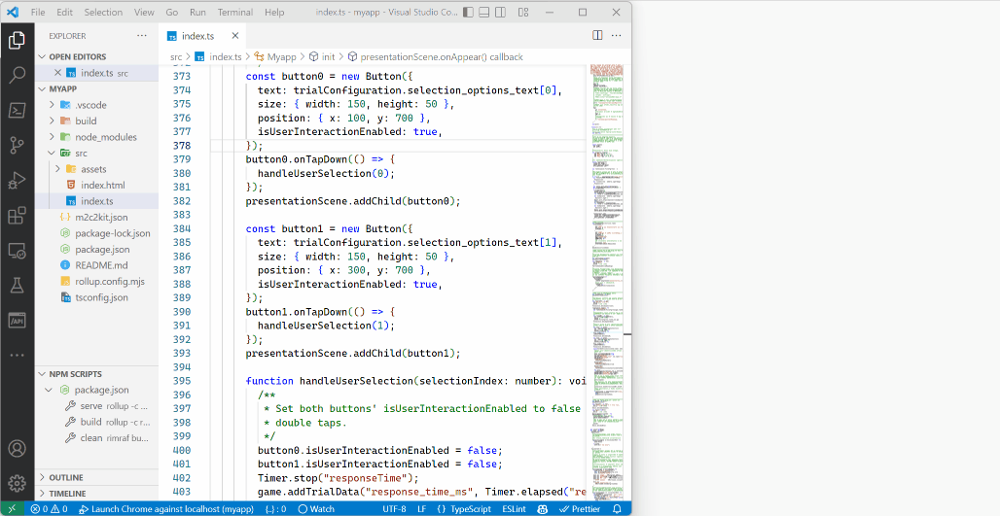

# @m2c2kit/cli

This package contains a command line interface (CLI) for developing m2c2kit cognitive assessments.

## Prerequisites

- [Node.js](https://nodejs.org) (version >=16)
- [Visual Studio Code](https://code.visualstudio.com/download) is highly recommended

## Creating a cognitive assessment

The CLI can quickly scaffold a demo app and serve it on your local machine. The CLI is installed as the command `m2`. The following commands will install the CLI, scaffold a demo app with an assessment (a simple [Stroop](https://en.wikipedia.org/wiki/Stroop_effect) assessment), and serve it on localhost, port 3000:

```
npm install -g @m2c2kit/cli
m2 new myapp
cd myapp
npm run serve
```

You can now go to http://localhost:3000 to view the demo app.



Note: if you execute `npm run build`, it will create a production build in `dist` that is suitable for deploying to a web server. In a production build, all build artifacts (except for `index.html`) will have hashes added to their filenames to promote cache busting upon repeated deployments.

## Visual Studio Code

When creating a project with `m2 new`, the CLI will configure the project for debugging with Visual Studio Code and Chrome. When the app is served locally (`npm run serve`), debugging in Visual Studio Code is available by pressing `F5` or selecting Run, Start Debugging.



## Adding more cognitive assessments

m2c2kit has a rich API for writing your own cognitive assessments. In addition, the m2c2kit team has developed cognitive assessments in ready-to-use form, which are available as separate packages (`@m2c2kit/assessment-symbol-search`, `@m2c2kit/assessment-color-dots`, `@m2c2kit/assessment-grid-memory`, `@m2c2kit/assessment-color-shapes`). Once you have scaffolded the demo app, to add additional assessments:

1. Install the package for the assessment. For example, if you scaffolded your app above with `m2 new myapp`, and now you want to add the m2c2kit Symbol Search assessment, execute the following from the `myapp` directory: `npm install @m2c2kit/assessment-symbol-search`.
2. Update your app's source code to import the Symbol Search assessment. In the file `src/index.ts`, add to the top: `import { SymbolSearch } from '@m2c2kit/assessment-symbol-search';`
3. Update your app's source code to create and use an instance of Symbol Search. In the file `src/index.ts`, find these lines:

```
const activity = new Myapp();
const session = new Session({
  activities: [activity],
```

and change to

```
const activity = new Myapp();
const ss = new SymbolSearch();
const session = new Session({
  activities: [ss, activity],
```

Now your app will run Symbol Search before it runs the demo assessment (Stroop).

## Configuring cognitive assessments

The assessments built by the m2c2kit team have reasonable default parameters, but assessments are also configurable. For example, the Symbol Search assessment has a default of 5 trials. To increase that to 10, find the code in `src/index.ts` that creates the `SymbolSearch` object and change it to:

```
const ss = new SymbolSearch({ "number_of_trials": 10 });
```

A full listing of the parameters for each assessments, and their default values, is available in repository for each assessment.

## License

MIT
