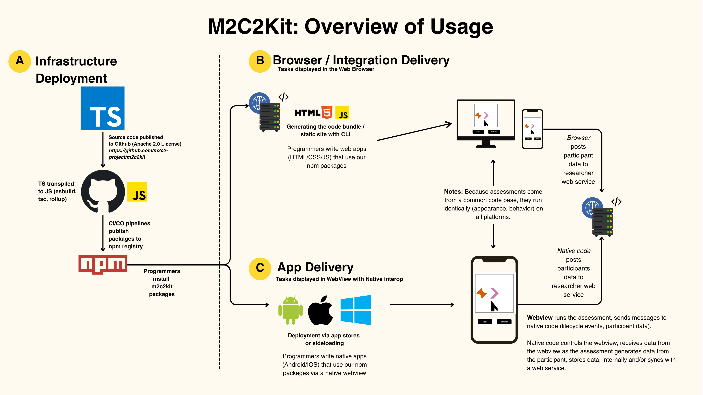

# Summary

Accurate and efficient measurement of brain health is critical for advancing research and clinical practice across multiple disciplines, including cognitive aging, neuropsychology, neuroscience, and medicine.

The m2c2kit project [@m2c2_site] provides an open-source framework (under the Apache 2.0 license) that enables the development, deployment, and analysis of mobile cognitive and motor assessments[@m2c2kit_docs]. It enables web-based delivery across many common modern platforms for data collection (e.g., Qualtrics, REDCap, Metricwire), as well as allowing for the embedding into WebViews of mobile apps.

The platform is designed to facilitate the creation of tests that are easy to administer via smartphones, tablets, and computers, making cognitive and motor assessments more accessible and scalable. These assessments developed in the m2c2kit and prior iterations of our assessments have been widely published and cited (e.g., [@sliwinski2018ambulatory], [@cerino2021variability], [@thompson2022remote], [@hakun2023workingmemory], [@shaleha2024digitalera])

By leveraging modern web technologies, m2c2kit allows researchers and clinicians to build, customize, and deploy assessments without requiring deep programming knowledge, ensuring that the tools are adaptable to a variety of study designs and populations.

m2c2kit leverages Google's canvaskit-wasm[@canvaskit_wasm] Skia-based graphics engine to present cognitive assessments using HTML5 and JavaScript (Skia is the 2D rendering library behind Chrome and other Google products). Features of m2c2kit include:

* Pixel-perfect rendering of stimuli across devices (mobile, desktop, tablet) and operating systems (iOS, Android, Windows, Linux). Assessments are rendered to the browser canvas using a graphics engine, rather than relying on a browser's HTML elements, which vary in appearance across devices.  
* Support for highly animated and graphical assessments, including physics. The graphics engine allows for complex animations and interactions that are not possible with standard HTML elements.  
* Comprehensive documentation with example assessments and live tutorials to illustrate how to create and deploy assessments using m2c2kit.  
* A command line interface (CLI) to scaffold new assessments and build deployments for a webserver.  
* Flexible deployment to participants. Assessments can be run on any device with a modern web browser. Assessments can be deployed as part of protocols that include other data collection tools, such as Qualtrics or REDCap. Alternatively, a mobile app with a webview can be created to run assessments natively on iOS or Android devices, as our partners at MetricWire have already done.

# Statement of Need

m2c2kit addresses the growing need for flexible, scalable tools that support cognitive and motor assessments within ambulatory protocols—enabling repeated, real-world measurement of brain health using mobile devices. Unlike traditional laboratory-based assessments, ambulatory cognitive assessment delivers brief cognitive tasks frequently throughout participants’ daily lives, allowing researchers to capture short-term fluctuations and patterns in cognition that may signal early disease processes, cognitive resilience, or contextual factors such as stress, sleep, and physical activity. This approach enhances measurement sensitivity and improves the ecological validity of cognitive testing, making it a critical tool for aging research, neurodegenerative disease studies, and digital health applications.  

## Purpose and Audience

***Despite the potential of mobile cognitive assessments, implementing them at scale remains a challenge.*** Traditional methods of administering these assessments can be costly ($10s of thousands of dollars), time-consuming, require specialized hardware, or be difficult to adapt to specific research needs. m2c2kit is a cross-platform solution that supports the creation of assessments using JavaScript and HTML, with a modular architecture that allows for the easy inclusion of new assessments or modification of existing ones. m2c2kit provides an API that is approachable for developers while maintaining flexibility and control to completely modify all aspects of an assessment's behavior and appearance. A key strength of the m2c2kit is that all assessments are generated from a common code base, ensuring identical appearance and behavior across all platforms. 

m2c2kit borrows some patterns, approaches, and naming conventions from Apple's SpriteKit, which is a very easy to use game framework, but m2c2kit is not a port of SpriteKit. Like SpriteKit, m2c2kit abstracts away drawing and frame timing calls that are a typical concern in game programming, instead letting the developer focus on implementing assessment logic and paradigms.

The m2c2kit platform was developed to promote open, scalable, and interoperable cognitive assessments for diverse research and clinical settings. m2c2kit contributes validated and highly interactive cognitive assessments that can be flexibly integrated into supported platforms (e.g., REDCap, Qualtrics, MyCap, custom apps). The m2c2kit development follows open-source best practices, with transparent versioning and a staged release process to ensure sustainability and reproducibility. The platform enables broad accessibility of cognitive assessments across populations and devices.

The platform supports integration with third-party libraries and services, ensuring that it can be easily adapted to meet the needs of various research domains, from psychology and neuroscience to clinical trials and education. The platform is also compatible with mobile devices, enabling widespread deployment and data collection in diverse settings. The m2c2kit GitHub repository includes documentation support for using the various game primitives (e.g., shapes, actions), developing your own novel assessments of cognition, and deploying them across various platforms for research (e.g., REDCap, Qualtrics, Metricwire). For more information regarding the flexibility of our platform, please read our whitepaper [@osf_34ux5].

Modern software development practices ensure quality. The core logic is tested with unit tests. Integration tests use browser automation to verify functionality, rendering, and behaviors. When new package versions are committed to the m2c2kit repository, deployment to npm [@npm] occurs through a GitHub Actions CI/CD pipeline (no manual deployments). Npm serves as the source of truth of the executable assessment and library packages: the same code will be consumed whether it executes on a mobile browser, desktop browser, or embedded within the web view of a mobile app. Npm’s wide availability and the immutability of its packages promote stability and reproducibility.

Other open-source libraries for cognitive assessment that share some functionality with m2c2kit include jsPsych [@jspsych] and lab.js[@labjs] and Gorilla [@gorilla_taskbuilder]. m2c2kit, however, is unique in that it supports highly interactive and graphical assessments, with animations and physics that are not possible with standard HTML elements. Thus, m2c2kit is especially well-suited for assessments that require complex stimuli or dynamic interactions.

Researchers at various career stages and technical skill levels have already adopted m2c2kit to support diverse research projects, demonstrating its practical utility and versatility (e.g., including testing device latency in an earlier version, [@nicosia2023byod]). By providing a robust, open-source framework for mobile cognitive and motor assessments, m2c2kit aims to accelerate the development and deployment of new assessments, facilitate large-scale data collection, and contribute to the advancement of research in cognitive science, psychology, and related fields.

# Figures

Figure 1 depicts the platform and intended usage for various common research workflows. The m2c2kit platform is designed to be flexible and adaptable, allowing researchers to create and deploy cognitive assessments across a variety of platforms and devices. The platform supports integration with third-party libraries and services, ensuring that it can be easily adapted to meet the needs of various research domains, from psychology and neuroscience to clinical trials and education.

# Acknowledgements

The development of m2c2kit was made possible by funding from the National Institute on Aging, U2CAG060408. We acknowledge contributions to this manuscript from Jessie Alwerdt, Dan Elbich, Jonathan Hakun, and Martin Sliwinski.

# Citations

