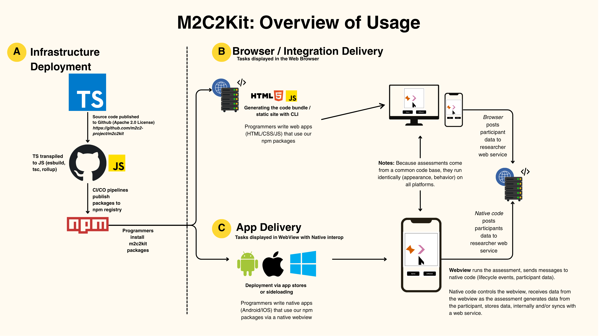

# Summary

Accurate and efficient measurement of brain health is critical for advancing research and clinical practice across multiple disciplines, including cognitive aging, neuropsychology, neuroscience, and medicine.

The m2c2kit project [@m2c2_site] is an open-source framework, released under the Apache 2.0 license, for developing and deploying mobile cognitive and motor assessments [@m2c2kit_docs]. Assessments can be delivered through modern web browsers and integrated into common research data-collection platforms, including Qualtrics and REDCap, or embedded within WebViews in native mobile applications.

m2c2kit is designed to make cognitive and motor assessments portable across smartphones, tablets, and computers while preserving consistent appearance and behavior. Assessments developed using m2c2kit and prior iterations of the framework have been used in published research on ambulatory and mobile cognitive assessment (e.g., [@sliwinski2018ambulatory], [@cerino2021variability], [@thompson2022remote], [@hakun2023workingmemory], [@shaleha2024digitalera]).

The framework uses Google's CanvasKit WebAssembly package [@canvaskit_wasm], based on the Skia 2D graphics engine, to render assessments within an HTML canvas. This architecture supports consistent rendering across devices and operating systems as well as graphical, animated, and interactive assessment paradigms. m2c2kit also provides documentation, example assessments, tutorials, and a command-line interface for scaffolding assessments and generating deployable web bundles.

# Statement of Need

m2c2kit addresses the need for flexible and scalable tools for cognitive and motor assessment within ambulatory research protocols. Ambulatory cognitive assessment involves administering brief cognitive tasks repeatedly throughout participants' daily lives. These intensive measurements allow researchers to characterize short-term fluctuations and patterns in cognition that may be associated with disease processes, cognitive resilience, or contextual factors such as stress, sleep, and physical activity. Compared with assessment restricted to laboratory settings, this approach can increase ecological validity and provide measurements at times and places relevant to participants' everyday functioning.

Despite the potential of mobile cognitive assessment, implementing these protocols at scale remains challenging. Existing approaches may require specialized hardware, substantial licensing or development costs, or systems that are difficult to adapt to the requirements of a particular research study. m2c2kit provides a modular framework in which developers can create and modify assessments using TypeScript/JavaScript while retaining control over assessment behavior, appearance, timing, and data generation.

The intended users include researchers, research software developers, and clinicians who need customizable cognitive or motor assessments that can operate across heterogeneous participant devices. Assessments can run directly in modern web browsers, as components of protocols incorporating platforms such as REDCap or Qualtrics, or inside WebViews controlled by native mobile applications.

# State of the Field

Several existing tools support computerized behavioral and cognitive experiments. Open-source libraries such as jsPsych [@jspsych] and lab.js [@labjs], as well as systems such as Gorilla [@gorilla_taskbuilder], provide important capabilities for creating and administering browser-based experiments. These tools have substantially expanded access to online behavioral research.

m2c2kit addresses a complementary design problem: delivering highly interactive and graphics-intensive cognitive assessments from a common code base across browsers and native mobile WebViews. Rather than constructing an assessment primarily from standard HTML interface elements, m2c2kit renders assessment scenes through a graphics engine. This permits precise control over stimulus appearance, animation, interactions, and physics while reducing platform-dependent differences in the presentation of HTML elements.

The decision to develop a separate framework rather than implement these capabilities as extensions to an existing experiment library reflects this architectural distinction. m2c2kit requires a scene-oriented rendering and interaction model in which drawing, animation, frame timing, input, and assessment events share a common abstraction. The framework borrows patterns and naming conventions from Apple's SpriteKit but is not a port of SpriteKit. Like SpriteKit, m2c2kit abstracts drawing and frame-timing operations so developers can focus on assessment logic and experimental paradigms.

This architecture makes m2c2kit particularly appropriate for assessments involving dynamic stimuli, animations, or interactions for which rendering consistency is an important measurement consideration. It also permits the same assessment package to be used in browser-based studies and as the assessment component of a native application.

# Software Design

m2c2kit is organized around a common TypeScript code base that is compiled into JavaScript packages and distributed through npm [@npm]. Researchers and developers install these packages to construct assessments, and the resulting code can be bundled into a static web application for browser delivery or loaded within a WebView in a native application. Figure 1 summarizes these deployment paths.

A central design decision is the use of CanvasKit [@canvaskit_wasm] and its Skia-based graphics engine. Rendering assessment stimuli to a canvas rather than relying primarily on platform-specific HTML controls provides a common graphical environment across desktop and mobile browsers. The trade-off is that m2c2kit maintains its own scene and interaction abstractions rather than delegating presentation to the browser's document interface. This additional abstraction is useful for research applications in which control over stimulus presentation, animation, and interaction is important.

A second design decision is to separate assessment logic from the environment responsible for deployment and participant-data management. In a browser-only workflow, the assessment can post participant data to a researcher's web service. In a native application, the WebView executes the same assessment while native code can manage lifecycle events, local storage, participant information, and synchronization with external services. This permits researchers to reuse an assessment across deployment environments without maintaining separate browser, iOS, and Android implementations.

m2c2kit also emphasizes reproducible software distribution. Core logic is covered by unit tests, while integration tests use browser automation to verify functionality, rendering, and behavior. Package releases are published to npm through a GitHub Actions CI/CD pipeline rather than through manual deployment. The immutable versioned packages distributed by npm therefore provide a common executable source for assessments running in mobile browsers, desktop browsers, or embedded WebViews.

The project additionally provides a command-line interface for scaffolding assessments and generating deployments, along with documentation covering graphical primitives, assessment development, and integration with research platforms. These components are intended to reduce the amount of platform-specific infrastructure that individual research teams must implement and maintain.

# Research Impact Statement

m2c2kit and earlier iterations of its assessment framework have supported published research using ambulatory and mobile cognitive assessment. Applications include studies of ambulatory cognitive variability [@sliwinski2018ambulatory], remote cognitive assessment [@thompson2022remote], working-memory measurement [@hakun2023workingmemory], and other research using repeated digital cognitive measurements [@cerino2021variability; @shaleha2024digitalera]. Earlier versions of the framework have also been used in research evaluating device-related measurement characteristics and latency [@nicosia2023byod].

The framework has been adopted across research projects involving investigators at different career stages and technical skill levels. Its deployment model supports integration into established research workflows, including REDCap and Qualtrics, while its WebView interface permits integration into native data-collection applications. MetricWire has used this approach to embed assessments within its mobile application environment.

These uses demonstrate that m2c2kit functions as reusable research infrastructure rather than software developed for a single analysis or study. Its common rendering architecture and package-based distribution allow assessment implementations to be reused across projects and participant platforms, while its open-source design allows researchers to inspect, modify, and extend the software for new assessment paradigms. Additional information about the framework and its flexibility is available in the project whitepaper [@osf_34ux5].

# Figures

Figure 1 depicts the m2c2kit software distribution and deployment architecture. Source TypeScript is compiled and distributed as JavaScript packages through npm. Researchers can use these packages to build browser-based assessments or integrate the same assessment code into native applications through a WebView. In both deployment modes, participant data can be transmitted to researcher-controlled web services.

{#fig:overview width="100%"}

# AI Usage Disclosure

Generative AI tools were used for code review and copy-editing portions of this manuscript. All AI-assisted code and text was reviewed and edited by the authors. The authors are responsible for the final content of the manuscript and made the core scientific, architectural, and software design decisions described here.

# Acknowledgements

The development of m2c2kit was made possible by funding from the National Institute on Aging through grant U2CAG060408. This research was also supported by grant U24AG092760 from the National Institute on Aging, part of the National Institutes of Health. The content is solely the responsibility of the authors and does not necessarily represent the official views of the National Institutes of Health.

We acknowledge contributions to this manuscript from Jessie Alwerdt, Dan Elbich, Jonathan Hakun, and Martin Sliwinski.

# Citations
